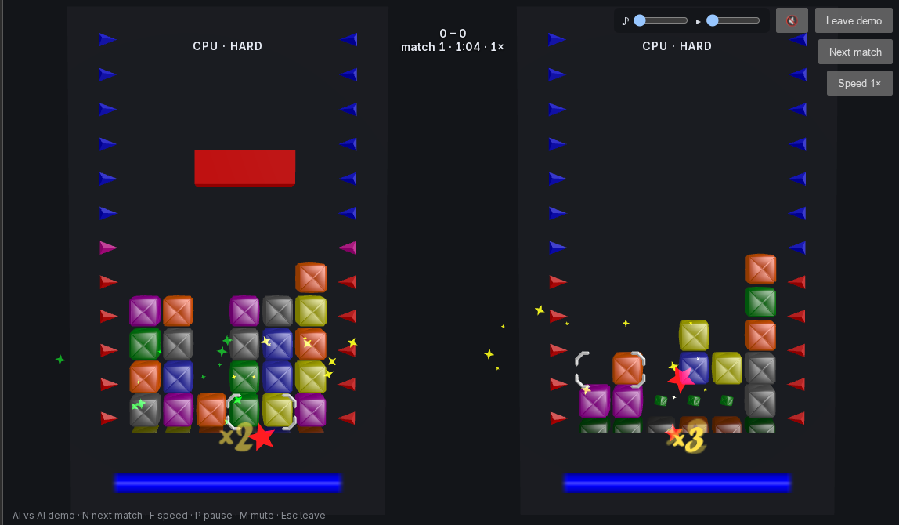

# Crack Attack! (web)

A browser port of [Crack Attack!](https://www.nongnu.org/crack-attack/) — a GPL
clone of Tetris Attack — from C++/OpenGL to TypeScript. It runs the same
real-time block-matching game in the browser with Three.js rendering and
server-relayed lockstep multiplayer plus a lobby, plus solo play and an AI
opponent.



**Play it: [c-a.foggyden.org](https://c-a.foggyden.org/)** — solo, against the
AI, or in the multiplayer lobby. Or just watch: the AI-vs-AI demo mode plays
itself.

The project is a pnpm monorepo:

| Package             | What it is                                                          |
| ------------------- | ------------------------------------------------------------------- |
| `packages/core`     | Deterministic simulation — zero deps, runs in the browser and Node. |
| `packages/protocol` | Wire message types + codec shared by client and server.             |
| `packages/client`   | Three.js renderer, input, HUD, audio (a Vite app).                  |
| `packages/server`   | Lobby + lockstep relay + solo scoreboard (Node, `ws`, SQLite).      |
| `tools/`            | Dev tooling: `ai-arena`, `replay-check`, `obj2gltf`.                |

## Requirements

- **Node** `>=22.13.0` (the relay uses Node's built-in `node:sqlite`)
- **pnpm** `9.x` — the repo pins it via the `packageManager` field, so the
  simplest way to get the right version is Corepack (bundled with Node):

  ```sh
  corepack enable
  ```

  After that, `pnpm` in the repo root uses the pinned version automatically. (If
  you can't enable Corepack, `npm i -g pnpm@9` works too.)

## Install

```sh
pnpm install
```

## Everyday commands

Run these from the repo root; they operate across all packages.

```sh
pnpm build          # compile everything (tsc -b, project references)
pnpm test           # run the test suite once (Vitest)
pnpm test:watch     # watch mode
pnpm typecheck      # type-check without emitting (tsc -b)
pnpm lint           # eslint .
pnpm format         # prettier --write .
pnpm format:check   # prettier --check .
pnpm clean          # tsc -b --clean
```

Tests are co-located with the source as `*.test.ts`. To run a single file:

```sh
pnpm exec vitest run packages/core/src/aiController.test.ts
```

## Run the client (solo, in the browser)

```sh
pnpm --filter @crack-attack/client dev
```

Vite serves the app (default <http://localhost:5173>). Solo play works entirely
in the browser with no server. From the solo screen you can also start a **Play
vs AI** match or switch to **Play online** (netplay — needs the relay, see
below).

Solo runs can also compete on the online high-score boards the relay hosts
(see [Solo scoreboard](#solo-scoreboard)):

- With **Ranked: on** (the default), each game starts from a server-issued
  seed. At game over the run is submitted, then verified and ranked by the
  server.
- The first ranked game over asks for the name shown on the boards
  (prefilled with your lobby name), or lets you skip submitting that run.
- The HUD shows `RANKED`, `PRACTICE`, or why a run is unranked, then the run's
  monthly and all-time place.
- Pausing a ranked run hides the board.
- **High scores** opens the boards.
- If the relay can't be reached, solo still plays, just unranked. A finished
  run waits and is sent later.

Controls:

- **← → ↑ ↓** move the cursor · **Z** / **Space** swap · **X** raise the stack
- **R** restart (solo) / ready-rematch (netplay) · **P** pause (solo) · **M** mute
- **Esc** concede / stop watching (netplay)
- Music starts **off** (sound effects are on); turn it up with the ♪ slider at
  the top right, and the setting is remembered.

### Production build

```sh
pnpm --filter @crack-attack/client build     # outputs to packages/client/dist/web
pnpm --filter @crack-attack/client preview    # serve the built bundle locally
```

The app must be served over HTTP(S) — opening `dist/web/index.html` directly via
`file://` won't load ES modules. Use `dev`/`preview`, or host `dist/web` behind
any static file server.

### Deploying the client

The build is plain static files — upload the contents of `dist/web` to any web
server, at the domain root or a subdirectory (asset paths are relative). Nothing
runs server-side; only online play and ranked solo runs need the separate relay
(set `VITE_RELAY_URL` at build time, see below). Without the relay, solo still
plays, unranked.

For a fast first load, configure the server to:

- **Compress** text assets (`.js`, `.html`, `.gltf`) with gzip or Brotli. The
  first-load JavaScript is ~700 kB raw but ~185 kB gzipped.
- **Cache `assets/` forever.** Its file names carry a content hash, so they can
  be `Cache-Control: public, max-age=31536000, immutable`. Three.js is split
  into its own chunk, so a game update doesn't make returning players
  re-download it.
- **Don't cache `index.html`** (`Cache-Control: no-cache`) so a new deploy is
  picked up immediately. The other files (`textures/`, `music/`, `sounds/`,
  `models/`) aren't hashed, so give them a modest max-age.

Only the solo board and the attract-mode title load up front; vs-AI, the
AI-vs-AI demo (which attract mode fetches straight away), and netplay are
fetched when first opened. If a tab left open across a redeploy can't find its
old chunk, it falls back to the solo screen — keeping the previous deploy's
`assets/` files around for a while avoids even that.

Example (nginx):

```nginx
location /assets/ { add_header Cache-Control "public, max-age=31536000, immutable"; }
location = /index.html { add_header Cache-Control "no-cache"; }
gzip on;
gzip_types application/javascript model/gltf+json;
```

### Client URL parameters

With no parameters the game opens in attract mode, like an arcade cabinet: the
title card, then hard-vs-hard AI matches that play until you press a key or
click, which starts a solo game.

Append these to the client URL (e.g. `http://localhost:5173/?net`):

- `?solo` — skip attract mode and boot straight into solo play.
- `?net` — boot straight into netplay instead.
- `?scores` — open the online high-score boards.
- `?demo` — boot straight into the AI-vs-AI demo with its viewer controls
  (hard vs hard); `?demo=easy,hard` picks the left and right bots. Handy as a
  showcase link.
- `?relay=<url>` — override the relay WebSocket URL for this session, e.g.
  `?relay=ws://localhost:8080` or `?relay=wss://example.com/ws`.
- `?tune` — open the lighting/material render tuner (dev aid).

## Run the relay server (for multiplayer and the scoreboard)

Netplay, spectating and ranked solo runs go through the relay. In development, build it once,
then start it from the repo (to deploy it, see [Standalone build](#standalone-build-for-deploying)):

```sh
pnpm --filter @crack-attack/server build
pnpm --filter @crack-attack/server start
```

It listens on **:8080** by default and prints the address it bound to. The relay
forwards input frames, assigns rooms/seeds, compares digests, and persists
win/loss records — it never runs a netplay simulation itself. The same port
also serves the [solo scoreboard](#solo-scoreboard), the one place the server
does run the game: to verify submitted runs.

Abuse limits: incoming WebSocket messages are capped at **16 KiB** (the largest
legitimate one is under 1 KiB; ws closes an offending connection with code
1009), and a player whose input stream outruns real time by more than ~2 s or
exceeds the per-match ledger cap is disconnected like any protocol violation.
Background store failures (e.g. a busy SQLite file when recording a forfeit)
are logged to stderr and the relay keeps serving.

### Server environment variables

| Var           | Default             | Meaning                                                                                                                                                                                                                                                                                                                                                                                                                                                                                              |
| ------------- | ------------------- | ---------------------------------------------------------------------------------------------------------------------------------------------------------------------------------------------------------------------------------------------------------------------------------------------------------------------------------------------------------------------------------------------------------------------------------------------------------------------------------------------------- |
| `PORT`        | `8080`              | TCP port. Base-10 integer `0..65535`; `0` lets the OS pick a port.                                                                                                                                                                                                                                                                                                                                                                                                                                   |
| `HOST`        | all interfaces      | Interface to bind (e.g. `127.0.0.1` for local-only).                                                                                                                                                                                                                                                                                                                                                                                                                                                 |
| `DB`          | `./crack-attack.db` | SQLite file for identities, records and the solo scoreboard. Use `:memory:` for ephemeral.                                                                                                                                                                                                                                                                                                                                                                                                           |
| `TRUST_PROXY` | off                 | The number of reverse proxies in front that append to `X-Forwarded-For` (`1` or `true` behind nginx alone, `2` behind a CDN and nginx); the scoreboard's rate limits then key on the client address that many entries from the right. Set it only behind proxies that set the header, and with two or more, only if the inner proxy accepts connections from the outer one alone (see the notes under [Production: TLS termination with nginx](#production-tls-termination-with-nginx-recommended)). |
| `CORS_ORIGIN` | unset               | `Access-Control-Allow-Origin` for the scoreboard API, if the client is served from another origin (e.g. `https://example.com`, or `*`).                                                                                                                                                                                                                                                                                                                                                              |

Examples:

```sh
# Local-only relay on a custom port, no persistence:
PORT=9000 HOST=127.0.0.1 DB=:memory: pnpm --filter @crack-attack/server start

# Persist records to a specific file:
DB=/var/lib/crack-attack/lobby.db pnpm --filter @crack-attack/server start
```

### Solo scoreboard

The relay also hosts the solo high-score boards, over plain HTTP on the same
port. A ranked run starts from a server-issued ticket (a fresh seed). At game
over the client submits its replay, and the relay re-simulates it and ranks the
score _it_ computed, so a client can't claim a score it didn't play. The design
is in [`docs/SCOREBOARD_PLAN.md`](docs/SCOREBOARD_PLAN.md).

| Route                      | What it does                                                                        |
| -------------------------- | ----------------------------------------------------------------------------------- |
| `POST /api/solo/ticket`    | Issues a run ticket: `{runId, seed, simVersion, expiresAt}`.                        |
| `POST /api/solo/submit`    | `{runId, name, replay}` → the verified score, with its all-time and monthly rank.   |
| `GET /api/solo/scores`     | A board: `board=score\|mult`, `period=all\|month`, `month=YYYY-MM`, `limit=1..100`. |
| `GET /api/solo/replay/:id` | A run's replay.                                                                     |

Limits:

- Tickets are single-use and expire after 24 h.
- A run can't be submitted sooner than it takes to play.
- Submissions are capped at 256 KiB.
- Each client address (IPv6: each /64) gets a burst of 30 tickets (then one
  every 10 s), 20 submissions (then one every 20 s), 60 board requests (then
  one a second) and 30 replay requests (then one every 2 s).
- Tickets and submissions are also limited per IPv6 /48 (tickets 120, then
  one every 2.5 s; submissions 80, then one every 5 s) and across all clients
  (tickets 600, then five a second; submissions 300, then one a second). While
  a limit shared by all clients is turning requests away, the relay logs it
  (at most every 10 minutes): if it's tickets, every player is playing
  unranked.
- A replay may change its input at most once every 3 ticks on average (plus
  100), more than anyone keeps up over a whole game.
- Board responses are cached for 5 s, so a run hidden with `admin hide` may
  show for that long (and its replay for a minute, in HTTP caches).
- Replays are verified one at a time in short slices, so a long one never
  stalls netplay. If too many are waiting, the API answers 503. Copies of a
  submission sent while it's being verified share its result.

A run's replay is kept for a week, then only if the run is among the top 100
of its month or of all time, on either board (what the boards can show). Runs
past that stay on the boards, without a replay. To take a run off the boards,
find it with `recent` and hide it. This works while the relay is running:

```sh
DB=/var/lib/crack-attack/lobby.db node relay.mjs admin recent 50
DB=/var/lib/crack-attack/lobby.db node relay.mjs admin hide 1234
DB=/var/lib/crack-attack/lobby.db node relay.mjs admin unhide 1234
```

`admin` refuses a `DB` path with no database there (a typo), rather than create
an empty one. In development, run `node packages/server/dist/main.js admin …`
instead.

The client finds the API on the relay's host: `wss://example.com/ws` →
`https://example.com/api/solo`. In development the client (port 5173) and the
relay (port 8080) are different origins, so start the relay with `CORS_ORIGIN`
to play ranked runs locally:

```sh
CORS_ORIGIN=http://localhost:5173 pnpm --filter @crack-attack/server start
```

### Standalone build (for deploying)

The relay packages into a single self-contained file that runs with plain Node:
no pnpm, no `node_modules`, nothing to compile on the server.

```sh
pnpm --filter @crack-attack/server bundle    # → packages/server/dist/relay.mjs
```

Copy `relay.mjs` anywhere and run it with Node 22.13 or newer; it takes the same
environment variables:

```sh
HOST=127.0.0.1 PORT=8080 DB=/var/lib/crack-attack/lobby.db node relay.mjs
```

It inlines the game packages and `ws`, and keeps records with Node's built-in
SQLite (`node:sqlite`), so there's no native add-on to install. On Node 22 it
prints a one-time `ExperimentalWarning` about SQLite (the module is still
labelled experimental there); it's harmless. A database written by an earlier
version of the relay opens as is, and is upgraded in place to add the
scoreboard's tables (older relays can still use it).

### Production: TLS termination with nginx (recommended)

Browsers block mixed content: a game served from an `https://` page may only
open **`wss://`** (TLS) WebSockets, so a plain `ws://` relay is refused outright.
The relay itself speaks plain WebSocket, so run it behind a reverse proxy that
terminates TLS. With nginx:

1. **Bind the relay to loopback** so its unencrypted port isn't reachable from
   outside:

   ```sh
   HOST=127.0.0.1 PORT=8080 TRUST_PROXY=1 DB=/var/lib/crack-attack/lobby.db node relay.mjs
   ```

2. **Proxy two paths on your HTTPS site to it:** `/ws` for the WebSocket and
   `/api/` for the scoreboard. The relay accepts WebSocket upgrades on any
   path, so it needs no extra configuration for `/ws`:

   ```nginx
   server {
     listen 443 ssl;
     server_name example.com;
     ssl_certificate     /etc/letsencrypt/live/example.com/fullchain.pem;
     ssl_certificate_key /etc/letsencrypt/live/example.com/privkey.pem;

     # The static client (dist/web) can be served from the same site.
     root /var/www/crack-attack;

     location /ws {
       proxy_pass http://127.0.0.1:8080;
       proxy_http_version 1.1;
       proxy_set_header Upgrade $http_upgrade;
       proxy_set_header Connection "upgrade";
       proxy_set_header Host $host;
       # The relay doesn't send heartbeats yet, so an idle lobby socket is
       # silent; nginx's 60 s default would cut it. Allow long-lived sockets.
       proxy_read_timeout 1h;
       proxy_send_timeout 1h;
     }

     location /api/ {
       proxy_pass http://127.0.0.1:8080;
       proxy_set_header Host $host;
       # The scoreboard rate-limits per client; with TRUST_PROXY=1 it reads
       # the address nginx appends here.
       proxy_set_header X-Forwarded-For $proxy_add_x_forwarded_for;
     }
   }
   ```

3. **Build the client with the public `wss://` URL** (the default fallback,
   same host on port 8080, won't match this setup):

   ```sh
   VITE_RELAY_URL=wss://example.com/ws pnpm --filter @crack-attack/client build
   ```

Notes:

- Let's Encrypt (e.g. `certbot --nginx -d example.com`) is the easy way to get
  and renew the certificate.
- The relay can also live on its own host or subdomain (e.g.
  `wss://relay.example.com/`); point `VITE_RELAY_URL` at it. The client then
  calls the scoreboard at `https://relay.example.com/api/solo`, another
  origin, so proxy `/api/` there too and start the relay with
  `CORS_ORIGIN=https://example.com` (the client's origin). Serving both from
  one site keeps it to a single certificate and needs no CORS.
- Behind the proxy, every connection reaches the relay from nginx's address.
  With `TRUST_PROXY=1` the scoreboard reads each client's address from the last
  `X-Forwarded-For` hop, the one nginx adds; the WebSocket side doesn't use
  client addresses. Behind a CDN in front of nginx, set `TRUST_PROXY=2` to use
  the entry the CDN added instead (else every client shares the CDN's bucket).
  Then nginx must accept connections from the CDN only (firewall it to the
  CDN's address ranges, or use the CDN's authenticated origin pulls). A client
  that reaches nginx directly can send its own `X-Forwarded-For: 9.9.9.9`;
  nginx appends the client's real address, and the forged entry lands where
  the CDN's would be.
  Ports (`1.2.3.4:5678`, `[2001:db8::1]:443`) are stripped, and an entry that
  isn't an IP address falls back to the connection's own address.
- To keep the relay running, a systemd unit works well (it shuts down cleanly
  on `systemctl stop`):

  ```ini
  [Unit]
  Description=Crack Attack! relay
  After=network.target

  [Service]
  WorkingDirectory=/opt/crack-attack
  ExecStart=/usr/bin/node /opt/crack-attack/relay.mjs
  Environment=HOST=127.0.0.1 PORT=8080 TRUST_PROXY=1 DB=/var/lib/crack-attack/lobby.db
  StateDirectory=crack-attack
  User=crack-attack
  Restart=on-failure

  [Install]
  WantedBy=multi-user.target
  ```

### Deploying the scoreboard

The scoreboard ships inside the relay, so a running deployment gets it by
upgrading the relay and the client. The steps below assume the setup above:
nginx in front, the relay as `crack-attack.service`, the database at
`/var/lib/crack-attack/lobby.db`.

1. **Build the relay and client from one commit.** A ranked run's ticket
   carries the relay's rules version (core's `SIM_VERSION`). A client built
   under other rules plays unranked (`UNRANKED — reload`) until it's reloaded,
   so whenever either changes, deploy both.

   ```sh
   pnpm install --frozen-lockfile
   pnpm --filter @crack-attack/server bundle
   node packages/server/scripts/smoke-bundle.mjs
   VITE_RELAY_URL=wss://example.com/ws pnpm --filter @crack-attack/client build
   ```

   The smoke test runs the bundle alone in an empty directory. It checks a
   WebSocket handshake, a ticket and the empty board, a clean stop, and the
   admin CLI.

2. **Back up the database.** The new relay's first start adds the
   scoreboard's tables in place. Older relays can still use the upgraded
   file, but keep a copy. The relay runs SQLite in WAL mode, so use `sqlite3`
   while it's running rather than `cp`:

   ```sh
   sqlite3 /var/lib/crack-attack/lobby.db ".backup /var/lib/crack-attack/lobby.db.bak"
   ```

   A clean stop folds the WAL back into the file, so after
   `systemctl stop crack-attack` a plain `cp` works too.

3. **Add the `/api/` location to nginx**, beside `/ws` (see the config
   [above](#production-tls-termination-with-nginx-recommended)), then run
   `nginx -t && systemctl reload nginx`. Doing this first is harmless: the old
   client never calls it.

4. **Set `TRUST_PROXY=1`** in the unit's `Environment=` line (the example unit
   has it), then run `systemctl daemon-reload`. Behind nginx every request
   comes from `127.0.0.1`. Without this setting, all players share one
   client's rate limits, so after a burst of 30 tickets everyone plays
   unranked.

5. **Swap the relay and restart it.** Rooms live in memory, so a restart ends
   any netplay match in progress. Pick a quiet moment.

   ```sh
   sudo install -m 644 packages/server/dist/relay.mjs /opt/crack-attack/relay.mjs
   sudo systemctl restart crack-attack
   journalctl -u crack-attack -n 20   # "crack-attack relay listening on :8080 (db: …)"
   ```

6. **Check the API through nginx:**

   ```sh
   curl -si -X POST https://example.com/api/solo/ticket   # 200 and {"runId":…,"seed":…}
   curl -s 'https://example.com/api/solo/scores?limit=5'  # "total":0 on a new board
   ```

   An nginx 404 page means the `/api/` location is missing. A 426 means the
   old relay is still running: it answers every plain HTTP request that way.
   The test ticket just expires unused.

7. **Upload the client** (see [Deploying the client](#deploying-the-client)).
   Play a ranked game to the end: the HUD should show `RANKED`, then the run's
   places, and `admin recent` should list it.

Running it:

- Run the admin CLI as the service's user, so any file SQLite creates beside
  the database belongs to the relay:

  ```sh
  sudo -u crack-attack env DB=/var/lib/crack-attack/lobby.db node /opt/crack-attack/relay.mjs admin recent 50
  ```

- Watch the log for lines starting `scoreboard:`. They report a limit shared
  by all clients turning requests away (when it's the ticket limit, every
  player is playing unranked) or a failed replay sweep.
- Each run adds a row. Its replay, a few KB, is kept for a week, then only if
  the run is on a top-100 board. The database keeps growing with the number of
  runs, so include it in regular backups (the `sqlite3 .backup` command above).
- To roll back, put the old `relay.mjs` and client back and restart. The old
  relay runs on the upgraded database and ignores the scoreboard's tables. An
  old relay with the new client works too, but every run is unranked
  (`UNRANKED — offline`).

## Wiring the client to the relay

The client resolves the relay WebSocket URL in this priority order:

1. **`?relay=<url>`** URL parameter (per-session override; handy in dev).
2. **`VITE_RELAY_URL`** — baked in at build time (the deployment story).
3. **Fallback**: the same host as the page, on port `8080`, with the scheme
   following the page's security context (an `https://` page uses `wss://`, an
   `http://` page uses `ws://`).

`VITE_RELAY_URL` is a Vite env var (any `VITE_`-prefixed variable is exposed to
the app). Set it for a dev session or a production build:

```sh
# Dev, pointing at a relay elsewhere:
VITE_RELAY_URL=ws://localhost:8080 pnpm --filter @crack-attack/client dev

# Production build baking in a deployed relay (e.g. behind a wss reverse proxy):
VITE_RELAY_URL=wss://example.com/ws pnpm --filter @crack-attack/client build
```

You can also put it in a `packages/client/.env` file (`VITE_RELAY_URL=...`).

### Local multiplayer test

1. Start the relay: `pnpm --filter @crack-attack/server start`
2. Start the client: `pnpm --filter @crack-attack/client dev`
3. Open the client, click **Play online**, and **Create room** — share the
   5-character room code (or click the room in the lobby list) from a second
   client to join. A third client can **watch** any room.

Identity is stored per browser origin (a session token in `localStorage`), so to
play a human-vs-human match on one machine, use **two different browsers** or a
**private/incognito window** for the second player — otherwise both tabs share
the same identity. Playing **vs AI** needs only one client.

### Playing vs AI

The AI opponent plays a real, visible board (not a scripted attacker). Choose a
difficulty (Easy clears matches on sight, Medium digs to churn up matches, Hard
plans combos and chains to attack):

- **Solo:** the **Play vs AI** button on the solo screen — two boards side by
  side, you vs the bot.
- **Netplay:** the **vs AI** button in the online lobby seats a bot instead of a
  second human. The bot is deterministic and computed identically on every
  client, so spectators see the same moves.

### Watching AI vs AI

**Watch AI vs AI** on the solo screen picks two bots and lets them play each
other, match after match, with a running tally — the in-browser version of the
`ai-arena` tool, and a quick way to show the game off. **N** skips to the next
match, **F** cycles 1×/2×/4× speed, **P** pauses, **Esc** leaves. No server
needed.

## Tools

Under `tools/` (see `tools/README.md` for more):

- **`ai-arena`** — a headless, deterministic AI-vs-AI match runner for measuring
  AI changes. After `pnpm build`:

  ```sh
  node tools/ai-arena/dist/cli.js --a candidate.json --b hard --seeds 50
  ```

  `--a`/`--b` take a preset name (`easy`/`medium`/`hard`) or a JSON tuning-override
  file; `--seeds N` runs a reproducible range; `--both` replays each seed with the
  seats swapped.

- **`replay-check`** — golden-master digest harness (core vs the C++ reference).
- **`obj2gltf`** — one-time Wavefront OBJ→glTF asset conversion.

## The C++ reference

We port from the original C++ Crack Attack! as the reference implementation:
<https://github.com/gnu-lorien/crack-attack>. It isn't needed to build or run
this port — it's used to port from and to validate against. See `AGENTS.md` for
the port status and architecture notes, and `BROWSER_PORT_PLAN.md` for the phase
plan.

## License

GPL-2.0-or-later. The original Crack Attack! is GPL v2; this port and any
converted assets are kept GPL-compatible. See `COPYING`, and
`packages/client/public/AUDIO_COPYRIGHT.txt` for audio-asset provenance.
